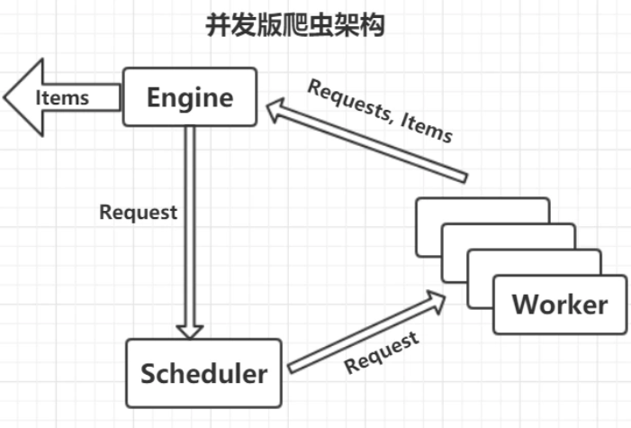
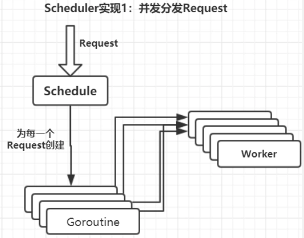
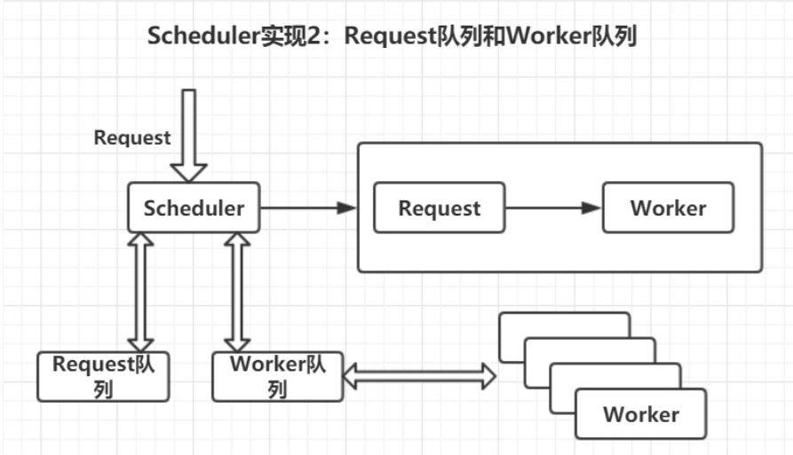

# Crawlery

## 历史版本

### V0.1：单任务版

#### 流程说明

1，配置种子请求，项目的初始入口。

2，把初始入口信息发送给爬虫引擎，引擎把其作为任务信息放入任务队列，只要任务队列不空就一直从任务队列中取任务。

3，取出任务后，engine 把要请求的任务 交给 Fetcher 模块，Fetcher 模块负责抓取 URL 页面数据，然后把数据返回给 Engine。

4，Engine收到网页数后，把数据交给解析  Parser  模块，Parser  解析出需要的数据后返回给  Engine，Engine  收到解析出的信息在控制台打印出来。

请求种子：Seed 模块

中间分发：Engine 模块

获取 URL 数据：Fetcher 模块

数据提取：Parse 模块

任务队列：requests []Request

#### 劣势

每次都要请求页面，然后才能解析数据，才能请求请求下一个页面。整个过程获取页面数据速度缓慢。

### V0.2：简单并发版

#### 涉及文件

engine/concurrent.go，engine/worker.go，engine/engine.go->engine/simple.go

scheduler/scheduler.go

#### 涉及改良点

将 Fetchet 模块 和 Parse 模块合并成一个 Worker 模块，然后并发执行 Worker 模块。

-   执行多个 worker ，同时每个 worker 任务接受一个 Request 请求，解析页面数据，输出解析的 Requests 和 Item。
-   存在多个 Request 和 Worker，所以还需要 Scheduler 模块，负责对请求任务的调度处理。
-   其中 Engine 和 Scheduler 是一个 goroutine ，Worker 包含多个 goroutine，各个模块之间都是用channel进行连接。

并发版设计：

任务调度器 Scheduler：

#### 劣势

调度器为每一个 Request 创建一个 goroutine，每个 goroutine 往 Worker 队列中分发任务，发完就结束。所有的 Worker 都在抢一个 channel 的任务。

不足：控制力弱，所有的 Worker 在 抢同一个 channel 中的任务，没办法控制给哪一个 Worker 任务。

### V0.3 队列实现并发任务调度

#### 涉及文件

engine/concurrent.go

scheduler/queued.go

main.go

#### 涉及改良点

-   当 Scheduler  接收到一个 Request 后，不直接发给 Worker，不能直接为每个 创建一个 goroutine，这里使用一个 Request 队列。
-   相对 Worker 实现更多的控制，可以决定把任务分发给哪一个 Woker，这里需要一个 Worker 队列。
-   有了 Request 和 Worker ，可以选择性把 Request 发送给 选择的 Worker。

